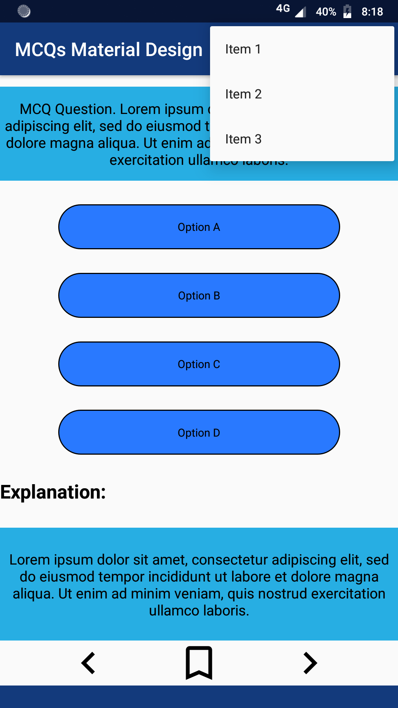

# MCQs Material Design
A sample MCQs **UI** for quiz implemented using **Constraint Layout, Custom Shape Drawables** and **Custom AppBar**.

## Introduction
This samples shows implemention of:
1. MCQs UI using **Constraint Layout** by aligning different views using constraints, instead of Linear Layout child and Relative Layout.
2. Custom **Shape Drawables** for better interface without losing quality.
3. Custom **AppBar Layout.**

## Usage
* Shape Drawables
* Custom AppBar
* Constraint Layout

## Pre-requisites
* Android SDK 28
* Android Build Tools v28.0.0
* Android Support Repository

## Getting started
This sample uses the Gradle build system. To build this project, use the "gradlew build" command or use "Import Project" in Android Studio.

## Screenshots
     

## Contributing
If you've found an error in this sample, please file an issue: https://github.com/iam844/MCQsMaterialDesign

Corrections are encouraged, and may be submitted by forking this project and submitting a pull request through GitHub.
